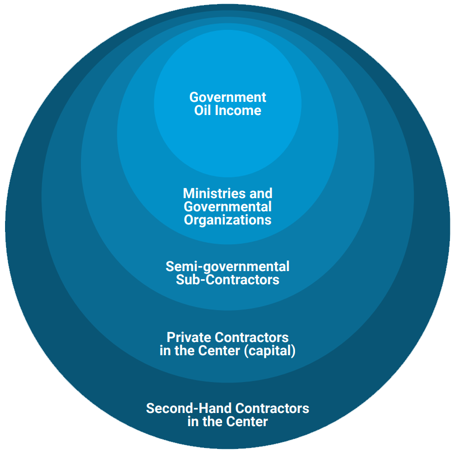
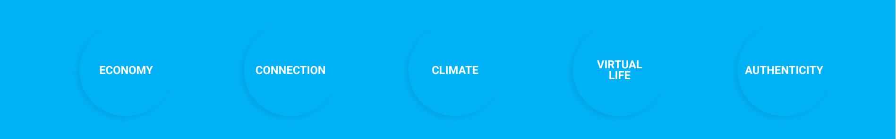
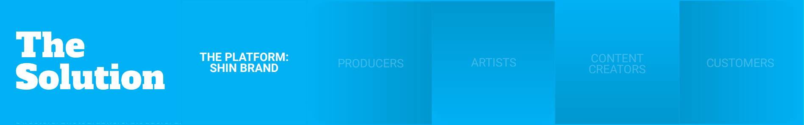
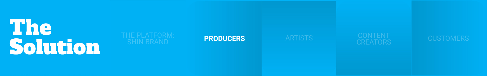
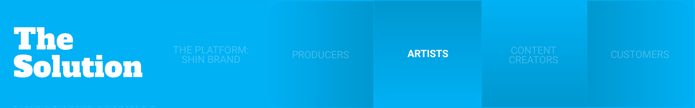
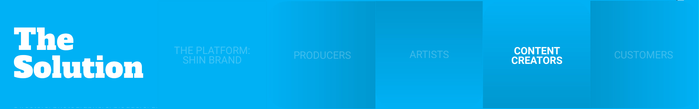
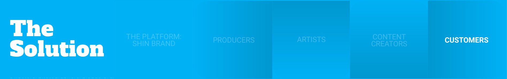

# ShinDAO Protocol

ShinDAO is a protocol on EVM-based blockchains that aims to connect local producers with artists and possible crypto investors to collectively produce goods and make the products accessible to customers in major cities.

Download and read our proposal in PDF.

## Understanding the Situation

Most developing countries around the world has a mixed economy with a large state-owned sectors. e.g. In Iran, even thought it is the world's 23rd largest by purchasing power parity, the distribution of wealth is extremely centralized.

Some 60% of the economy is centrally planned, dominated by oil and gas production, Although with 10% of the world's proven oil reserves and 15% of its gas reserves, Iran is considered an "energy superpower”, due to the presence of large religious/governmental foundations, wealth is unjustly distributed in the center, and citizens of small towns and villages do not gain any advantages.

Meanwhile, there are numerous decentralized
talents and local productions which are being
neglected by upper social classes.

This neglect is largely due to:
• Lack of clear communication
• Lack of decent logistics
• Lack of platforms to link the consumers to local productions

However, in recent years, the tendency towards
purchasing local goods has increased, yet the
above issues are still great barriers.

## The Opportunity

In the recent, there have been several reasons that have connected
the upper class to local community, including but not limited to:

## The Solutions

### ShinDAO Protocol
The protocol's brand will have its
semiological definition for responsible citizenship and reward its community of citizens with the protocol's native tokens.

Throughout its financial ecosystem, every acting environment receives rewards based on participation.
With clear guidelines for all stakeholders, the use of BrandX will become decentralized finance in its most generative experience.

All actions scale with an efficient Factory smart-contract that facilitates transactions autonomously among citizens.

### ShinDAO Producer
Product enabling parties may consist of two enabler categories that collaborate and facilitate product success as a Producer entity:

1. Local Producers
2. Crypto Investors

Producers can accept/set a guideline of production quality and roadmap to success based on expected customer reviews, while the protocol  provides them integrated markets, autonomous profit sharing and connects them to:

- Artists specialized in their category of products
- Product designs they can offer collaborations to

We plan to invite our network of 1000+ local roducers to present what they can produce.

### ShinDAO Artist
The protocol creates opportunities for artists to observe likeminded producer submissions. They arrive at mutual agreements that elevate both parties in concluding a finalized product.

Artists can get on board in their areas of interest while the protocol preserves their intellectual property rights.

The benefits of the deal in this environment between artists, local producers, and investing parties are shared based on a standard revenue-sharing model per each purchase.

### ShinDAO Content Creator
Directors, photographers, bloggers, and media can create content about the products, designs, or the SHIN Protocol based on proposed producer/protocol uidelines.

In return, they receive tokens for the service they offer, in addition to pro fits proportional to their participation in the end product.

The contents validations will be based on fixed protocols and will be validated by external oracles.

The platform Value Proposition document and the brand book will provide a specific guideline for the content creators to follow and create integrated marketing communication for the protocol itself.

### ShinDAO Customer
Customers will have access to the integrated markets. They can buy end products, follow artists/producers they like, and receive notifications on their latest products.

Customers' review of the quality for each product will help sort the producers based on meritocracy.

Customers can search the integrated markets or provide
reviews on products and promotional materials.

## ShinDAO Technical Intent

The protocol benefits enabling parties in its interconnected financial ecosystem. To simplify the processes we divide the ecosystem into 3 sections recited as Environments:

1. Manufacturers
2. Merchandisers
3. Markets

- The accumulated capacity of joint manufacturing enablers brings about talents and funds to output ERC20/ERC1155 tokenized goods. Products and intellectual property assets are reserved by a factory produced smart-contract, sold on integrated markets, while profits are shared according to contract agreements autonomously.

- Content creators can join the merchandising of products by making media and helping promote the products on the integrated markets. Upon oracle confirmation, they receive native tokens for network participation, in addition to financial benefits from a successful manufacturing beneficiary.

- Additional to a native user interface market, other commercial entities such as e-commerce stores, marketplaces, individual developers can integrate with the protocol, gain tokens for bringing active participation and profit from the sales of the end-products.

View the technical flowcharts by downloading and reading the proposal's.

## Appreciation and Contact
Thanks for reading through. If you dream for a better world, don't stop to change it. 

Willing to join us build? 

Drop us an email: 
[dev@shindao.org](mailto:dev@shindao.org)

